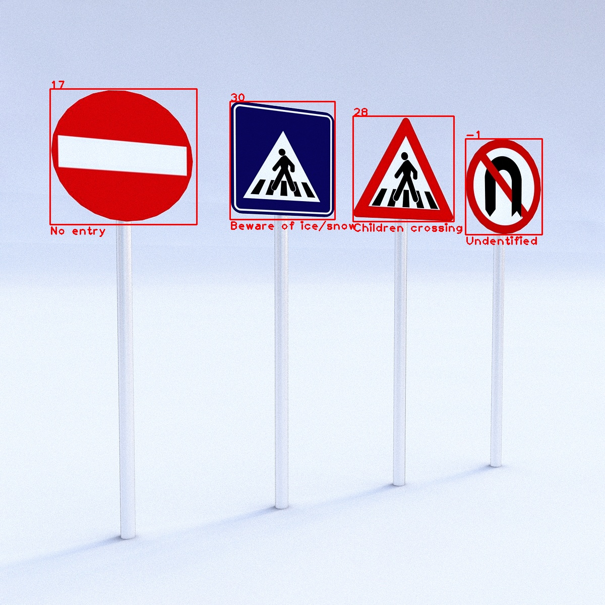

# TRAFFIC SIGN LOCALIZATION AND RECOGNITION

Easy way to recognize traffic sign. I use [OpenCV](https://docs.opencv.org/3.4/d4/d73/tutorial_py_contours_begin.html) to find contours for LOCALIZATION and train [LeNet-5](http://yann.lecun.com/exdb/lenet/) deep neural network architecture with [German traffic sign system](http://benchmark.ini.rub.de/?section=gtsrb&subsection=dataset) dataset for RECOGNITION.

## Demo

### Original image:

### Result:

## About Dataset

The full dataset consisted of 51,839 images RGB images with dimensions 32x32.

34,799 images were used as the training dataset, 12,630 images were used as the testing dataset, and 4,410 images were used as the validation dataset.

More information about this dataset you can read [here](http://benchmark.ini.rub.de/?section=gtsrb&subsection=dataset).

## LeNet-5 neural network

|      Layer      |                 Description                 |
| :-------------: | :-----------------------------------------: |
|      Input      |              32x32x3 RGB image              |
| Convolution 5x5 | 1x1 stride, valid padding, outputs 28x28x6  |
|      RELU       |            Rectified linear unit            |
|   Max pooling   |         2x2 stride, outputs 14x14x6         |
| Convolution 5x5 | 1x1 stride, valid padding, outputs 10x10x16 |
|      RELU       |            Rectified linear unit            |
|   Max pooling   |         2x2 stride, outputs 5x5x16          |
|     Flatten     |                 outputs 400                 |
| Fully connected |           input 400, outputs 120            |
|      RELU       |            Rectified linear unit            |
| Fully connected |            input 120, outputs 84            |
|      RELU       |            Rectified linear unit            |
| Fully connected |            input 84, outputs 43             |

More information in this paper: [Deep Sparse Rectifier Neural Networks](http://jmlr.org/proceedings/papers/v15/glorot11a/glorot11a.pdf)

### Train and validate the model

The network was ran 50 times (epochs) and the data was fed into the network in batches of 200 to reduce memory footprint.

The AdamOptimizer algorithm was used to optimize the objective function, instead of the gradient descent algorithm.

The network achieved an accuracy of **90.5%** on the test set.

## About code and library

You can read online or use jupyter to read file **"\*.ipynb"** for more information about installing library and code inside.

Dataset in folder **input** you can download [here](https://drive.google.com/file/d/1QFv3iIIbpL8pssn3mScpeWzq8fOJpnp1/view?usp=sharing).
